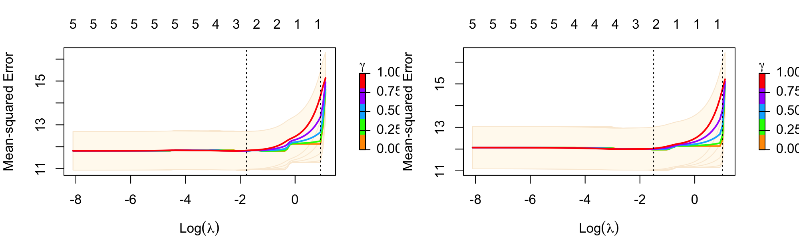

## Objectives

- Can the presence of interactions- and other non-linear effects be inferred by comparing the prediction performance of purely linear base model with random forest base models in MVS?

- Can residualizing the outcome with respect to a linear model help to evaluate non-linear or interaction signal using random forests?

## Summary & Conclusion

- In the empirical example using the NHANES data, random forest base models in the MVS configuration showed **no improvement** in predictive performance compared with MVS using only linear models. Therefore, coefficients are not further interpreted.

## Data

For the demonstration of the MVS extension, we used multi-source data from the US National Health and Nutrition Examination Survey (NHANES). The covariates are organized into six groups and a sum score of a depression questionnaire is used as the outcome. The sample consists of young adults aged between 20 and 30 years.

The data were selected based on age including participants aged between 20 to 30 years with a sample size of 853. Variables were selected based on available data. Descriptions of the variables are listed in a later section.

The group labels are:

- sociodemographics,

- dietary behavior,

- medical conditions,

- physical activity,

- sleep, and

- body measurements.

## Analysis

The analysis compares three different MVS configurations. Two configurations use consistent base learner, either linear base models or random forest base models only. The third configuration uses residual models, with linear base models fitted to the groups of covariates in views 1 to 6 and random forest models fitted to the same groups of covariates in views 7 to 12 using a residualized outcome obtained by subtracting the predictions from a linear model fitted to the corresponding group of covariates. 10-fold cross-validation was used for evaluating predictive performance.

## Results

**Table 1**

*Predictive performance*

|          | MVS Linear  | MVS Residual Models |
|----------|-------------|---------------------|
| MSE (SD) | 11.8 (0.01) | 11.8 (0.02)         |
| Test R²  | 0.22        | 0.22                |

*Note.* The variance of the outcome in the complete data is 15.2. Predictive R² was calulcated as 1 - mse / var(y_test). The reported values are calculated as means.

**Table 2**

*Medians of standardized coefficients*

+-------------------+---------------+----------------------+---------------+
|                   | MVS Linear    | MVS Residual Models\ | \             |
|                   |               | \                    | \             |
|                   |               | Linear               | Random Forest |
+===================+===============+======================+===============+
| Sociodemographics | 0             | 0                    | 0             |
+-------------------+---------------+----------------------+---------------+
| Dietary behavior  | 0             | 0                    | 0             |
+-------------------+---------------+----------------------+---------------+
| Medical condition | 0.13          | 0.14                 | 0             |
+-------------------+---------------+----------------------+---------------+
| Physical activity | 0             | 0                    | 0             |
+-------------------+---------------+----------------------+---------------+
| Sleep             | 0.42          | 0.42                 | 0             |
+-------------------+---------------+----------------------+---------------+
| Body measurements | 0             | 0                    | 0             |
+-------------------+---------------+----------------------+---------------+

## Using lambda.1se setting

**Table 1**

*Predictive performance*

|          | MVS Linear  | MVS Residual Models |
|----------|-------------|---------------------|
| MSE (SD) | 13.7 (0.01) | 13.7 (0.02)         |
| Test R²  | 0.10        | 0.11                |

*Note.* The variance of the outcome in the complete data is 15.2. Predictive R² was calulcated as 1 - mse / var(y_test). The reported values are calculated as means.

**Table 2**

*Medians of standardized coefficients*

+-------------------+---------------+----------------------+---------------+
|                   | MVS Linear    | MVS Residual Models\ | \             |
|                   |               | \                    | \             |
|                   |               | Linear               | Random Forest |
+===================+===============+======================+===============+
| Sociodemographics | 0             | 0                    | 0             |
+-------------------+---------------+----------------------+---------------+
| Dietary behavior  | 0             | 0                    | 0             |
+-------------------+---------------+----------------------+---------------+
| Medical condition | 0             | 0                    | 0             |
+-------------------+---------------+----------------------+---------------+
| Physical activity | 0             | 0                    | 0             |
+-------------------+---------------+----------------------+---------------+
| Sleep             | 0.27          | 0.35                 | 0             |
+-------------------+---------------+----------------------+---------------+
| Body measurements | 0             | 0                    | 0             |
+-------------------+---------------+----------------------+---------------+

### Plots of lambdas

### MVS default


### MVS residual models




### Plots of coefficient distributions

```{r, echo=FALSE}


# Helper function to summarize results
summarize_results <- function(res_list) {
  mse <- sapply(res_list, `[[`, "test_MSE")
  r2  <- sapply(res_list, `[[`, "test_R2")
  
  coefs <- do.call(cbind, lapply(res_list, `[[`, "std_coefficients"))
  
  list(
    MSE_mean = mean(mse, na.rm = TRUE),
    MSE_median = median(mse, na.rm = TRUE),
    
    R2_mean = mean(r2, na.rm = TRUE),
    R2_median = median(r2, na.rm = TRUE),
    
    coef_mean = rowMeans(coefs, na.rm = TRUE),
    coef_median = apply(coefs, 1, median, na.rm = TRUE)
  )
}


# Helper function to plot coefficients
library(Matrix)
library(reshape2)
library(ggplot2)

plot_coefficients <- function(res_list, title, view.names = NULL) {
  coefs <- do.call(cbind, lapply(res_list, `[[`, "std_coefficients"))
  
  coef_mat <- as.matrix(coefs)
  colnames(coef_mat) <- c(
    "fold 1",
    "fold 2",
    "fold 3",
    "fold 4",
    "fold 5",
    "fold 6" ,
    "fold 7",
    "fold 8",
    "fold 9",
    "fold 10"
  )
  
  coef_long <- reshape2::melt(coef_mat,
                              varnames = c("view", "fold"),
                              value.name = "coefficient")
  
  if( !is.null(view.names) ) {levels(coef_long$view) <- view.names}
  
  #coef_long <- cbind(coef_long, view.names)
  
  ggplot(coef_long, aes(x = view, y = coefficient)) +
    geom_boxplot() +
    geom_jitter(width = 0.15, alpha = 0.5) +
    #coord_flip() +
    labs(x = "View", y = "Coefficient", title = title) +
    theme_classic() +
    theme(axis.text.x = element_text(angle = 45, hjust = 1))
}


```

## Plots for lambda.min

```{r, echo = F}

res_mvs_default <- readRDS('res_mvs_default_lasso.rds')
#summarize_results(res_mvs_default)

plot_coefficients(res_mvs_default, title = "MVS Linear: Distribution of MVS coefficients by view", view.names = c("Sociodemographics", "Dietary Behavior", "Medical cond.", "Physical actvitiy","Sleep", "Body measur."))
```

#### 

```{r, echo = F}
# summarize_results(res_mvs_resid)
res_mvs_resid <- readRDS('res_mvs_resid_lasso.rds')

plot_coefficients(res_mvs_resid, title = "MVS Residual Models: Distribution of MVS coefficients by view", view.names = c("Sociodemogr. (LM)", "Dietary Beh. (LM)", "Medical cond. (LM)", "Physical act. (LM)","Sleep (LM)", "Body measur. (LM)", "Sociodemogr. (RF)", "Dietary Beh. (RF)", "Medical cond. (RF)", "Physical act. (RF)","Sleep (RF)", "Body measur. (RF)"))
```

## Plots for lambda.1se

```{r, echo = F}
res_mvs_default <- readRDS('res_mvs_default_lasso_1se.rds')
#summarize_results(res_mvs_default)

plot_coefficients(res_mvs_default, title = "MVS Linear: Distribution of MVS coefficients by view", view.names = c("Sociodemographics", "Dietary Behavior", "Medical cond.", "Physical actvitiy","Sleep", "Body measur."))
```

#### 

```{r, echo = F}
res_mvs_resid <- readRDS('res_mvs_resid_lasso_1se.rds')
# summarize_results(res_mvs_resid)

plot_coefficients(res_mvs_resid, title = "MVS Residual Models: Distribution of MVS coefficients by view", view.names = c("Sociodemogr. (LM)", "Dietary Beh. (LM)", "Medical cond. (LM)", "Physical act. (LM)","Sleep (LM)", "Body measur. (LM)", "Sociodemogr. (RF)", "Dietary Beh. (RF)", "Medical cond. (RF)", "Physical act. (RF)","Sleep (RF)", "Body measur. (RF)"))
```

# Variable names and descriptions

```{r, echo = F}
table_var_names <- readRDS('nhanes_table_var_names.rds')

table_var_names
```

# Model fitting syntax & helper functions

## Fitting MVS configurations

```{r eval=FALSE}

# MVS application to NHANES data ----

# Libraries
library(glmnet)
library(randomForest)
library(mvs)


# Helper function to extract results
extract_results <- function(model, y_train = y_train, newx = X_test, newy = y_test) {
  pred <- predict(model, newx = newx)
  test_mse <- mean((pred - newy)^2)
  test_r2 <- 1 - test_mse / var(newy)
  coefs <- coef(model)$`Level 2`[[1]]
  cv_variances <- apply(model$`Level 1`$CVs, 2, var)
  cv_sds <- sqrt(cv_variances)
  std_coefs <- coefs[-1,] * (cv_sds / sd(y_train))
  
  list(
    model = model,
    coefficients = coefs,
    std_coefficients = std_coefs,
    test_MSE = test_mse,
    test_R2 = test_r2,
    cv_variances = cv_variances
  )
  
}


# Helper function to extract results
extract_results_lambda1se <- function(model, y_train = y_train, newx = X_test, newy = y_test) {
  pred <- predict(model, newx = newx, cvlambda = "lambda.1se")
  test_mse <- mean((pred - newy)^2)
  test_r2 <- 1 - test_mse / var(newy)
  coefs <- coef(model, cvlambda = "lambda.1se")$`Level 2`[[1]]
  cv_variances <- apply(model$`Level 1`$CVs, 2, var)
  cv_sds <- sqrt(cv_variances)
  std_coefs <- coefs[-1,] * (cv_sds / sd(y_train))
  
  list(
    model = model,
    coefficients = coefs,
    std_coefficients = std_coefs,
    test_MSE = test_mse,
    test_R2 = test_r2,
    cv_variances = cv_variances
  )
  
}


# Load data
new_nhanes_complc <- readRDS('/Users/zinobrystowski/Documents/PhD Project/Projects 2 and 3/NHANES data/nhanes_cc.rds')

# Set seed
set.seed(42)

# Load helper function to compute results from MVS objects
#source('/Users/zinobrystowski/Documents/PhD Project/Projects 2 and 3/NHANES data/Helper functions/extract_results.R')


# Define view indices based on source and number of dummy variables
# colnames(model.matrix( ~ . - 1, new_nhanes_complc[, -c(1, 146)])) # minus ID and outcome

view_ids <- c(rep(1, 29), # Sociodemographics
              rep(2, 84), # Dietary behavior
              rep(3, 23), # Medical condition
              rep(4, 6), # Sleep
              rep(5, 6), # Physical activity
              rep(6, 8) # Body measures
              )

# Crate an index vector for CV folds
fold_inx <- mvs:::kFolds(1:nrow(new_nhanes_complc), 10)

# Create list objects to collect extracted results
res_mvs_default <- list()
res_mvs_rf <- list()
res_mvs_repeated <- list()
res_mvs_resid <- list()

for(i in 1:10) {
  
  # Split into training and test data
  X_train <- model.matrix( ~ . - 1, new_nhanes_complc[fold_inx != i , -c(1, 146)])
  y_train <- new_nhanes_complc[fold_inx != i, 146]
  X_test <- model.matrix( ~ . - 1, new_nhanes_complc[fold_inx == i , -c(1, 146)])
  y_test <- new_nhanes_complc[fold_inx == i, 146]
  
  # Fit MVS models ----
  
  # Fit MVS default
  mvs_default <- MVS(
    x = X_train,
    y = y_train,
    views = view_ids,
    progress = FALSE,
    family = "gaussian",
    relax = c(FALSE, TRUE)
  )
  
  # Compute results
  # res_mvs_default[[i]] <- extract_results(mvs_default, y_train = y_train, newx = X_test, newy = y_test)
  res_mvs_default[[i]] <- extract_results_lambda1se(mvs_default, y_train = y_train, newx = X_test, newy = y_test)
  

  
  # Repeated views MVS
  
  # Create a new predictor matrix Xrep with repeated views
  Xrep_train <- cbind(X_train, X_train)
  Xrep_test <- cbind(X_test, X_test)
  view_ids_rep <- c(view_ids, (view_ids + 6))
  
  # Specify type of base learner per view
  type <- list(
    level1 = c(
      "StaPLR",
      "StaPLR",
      "StaPLR",
      "StaPLR",
      "StaPLR",
      "StaPLR",
      "RF",
      "RF",
      "RF",
      "RF",
      "RF",
      "RF"
    ),
    meta = "StaPLR"
  )
  
  # MVS residual models
  
  # Specify type of base learner per view
  type <- list(
    level1 = c(
      "StaPLR",
      "StaPLR",
      "StaPLR",
      "StaPLR",
      "StaPLR",
      "StaPLR",
      "RF",
      "RF",
      "RF",
      "RF",
      "RF",
      "RF"
    ),
    meta = "StaPLR"
  )
  
  # Fit model with offset
  mvs_res_mod <- MVS(
    x = Xrep_train,
    y = y_train,
    views = view_ids_rep,
    type = type,
    progress = FALSE,
    family = "gaussian",
    offsets = list(c(1, 7), c(2, 8), c(3, 9), c(4, 10), c(5, 11), c(6, 12)),
    relax = c(FALSE, TRUE)
  )
  
  # Compute results
  # res_mvs_resid[[i]] <- extract_results(mvs_res_mod, y_train = y_train, newx = Xrep_test, newy = y_test)
  res_mvs_resid[[i]] <- extract_results_lambda1se(mvs_res_mod, y_train = y_train, newx = Xrep_test, newy = y_test)
  
}

```

## Helper functions

```{r, eval=FALSE}

# Helper function to extract results
extract_results <- function(model, newx = X_test, newy = y_test) {
  pred <- predict(model, newx = newx)
  test_mse <- mean((pred - newy)^2)
  test_r2 <- 1 - test_mse / var(newy)
  coefs <- coef(model)$`Level 2`[[1]]
  cv_variances <- apply(model$`Level 1`$CVs, 2, var)
  
  list(
    model = model,
    coefficients = coefs,
    test_MSE = test_mse,
    test_R2 = test_r2,
    cv_variances = cv_variances
  )
  
}

# Helper function to summarize results
summarize_results <- function(res_list) {
  mse <- sapply(res_list, `[[`, "test_MSE")
  r2  <- sapply(res_list, `[[`, "test_R2")
  
  coefs <- do.call(cbind, lapply(res_list, `[[`, "coefficients"))
  
  list(
    MSE_mean = mean(mse, na.rm = TRUE),
    MSE_median = median(mse, na.rm = TRUE),
    
    R2_mean = mean(r2, na.rm = TRUE),
    R2_median = median(r2, na.rm = TRUE),
    
    coef_mean = rowMeans(coefs, na.rm = TRUE),
    coef_median = apply(coefs, 1, median, na.rm = TRUE)
  )
}


# Helper function to plot coefficients
library(Matrix)
library(reshape2)
library(ggplot2)

plot_coefficients <- function(res_list, title) {
  coefs <- do.call(cbind, lapply(res_list, `[[`, "coefficients"))
  
  coef_mat <- as.matrix(coefs)[-1, ]
  colnames(coef_mat) <- c(
    "fold 1",
    "fold 2",
    "fold 3",
    "fold 4",
    "fold 5",
    "fold 6" ,
    "fold 7",
    "fold 8",
    "fold 9",
    "fold 10"
  )
  
  coef_long <- reshape2::melt(coef_mat,
                              varnames = c("view", "fold"),
                              value.name = "coefficient")
  
  ggplot(coef_long, aes(x = view, y = coefficient)) +
    geom_boxplot() +
    geom_jitter(width = 0.15, alpha = 0.5) +
    #coord_flip() +
    labs(x = "View", y = "Coefficient", title = title) +
    theme_classic()
}

```
